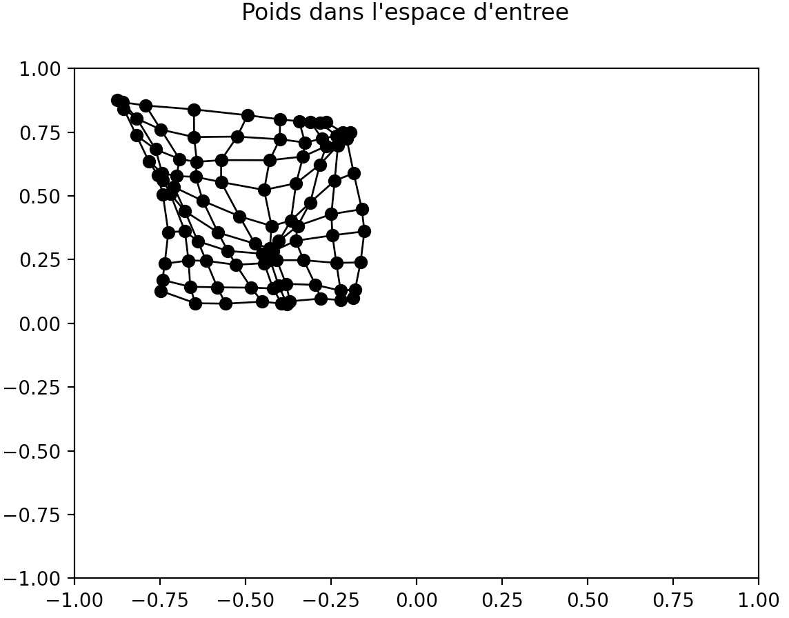

<h1>Techniques de l'Intelligence Artificielle</h1>
<h2>Réseaux de neurones</h2>
<h3>Documents réponses</h3>
<h4>Richard BRUNEAU</h4>

<h3>Étude "théorique" de cas simple</h3>
<h4>Influence de η</h4>

Si η est égale à 0, alors ΔWi,j = 0. Du coup, la prochaine valeur du neurone gagnant ne changera pas

Si η est égale à 1, alors ΔWi,j = 1*1*(xi-wi,j). Du coup, la prochaine valeur du poids va tendre vers X.

Si η est compris entre ]0,1][, alors Wi,j = η*1*(xi-wi,j). Du coup, si η tend vers 0, la valeur du neurone restera proche de W* et si η tend vers 1, la valeur va tendre vers X.

<h4>Influence de σ</h4>

 Si σ augmente, alors la division va tendre vers 0. Nous allons donc avoir la fonction de voisinage qui tend vers 1. Cela pour effet que les voisins vont plus apprendre l'entrée courante.

 Plus σ est grand, plus l'auto-organisation obtenue sera resserée. En effet, plus le sigma augmente, plus les neurone apprennent et donc plus ils se déplacent.

 Une mesure envisageable pour quantifier l'influence de σ serait de mesurer l'aire de la grille en fonction de différents σ et d'essayer de trouver un rapport entre la différence de l'air et la variation du sigma. Si nous prenons 4 points avec pour coordonnées :  
A = (Xmin, Ymax), le point en haut à gauche  
B = (Xmax, Ymax), le point en haut à droite  
C = (Xmin, Ymin), le point en bas à gauche  
et D = (Xmax, Ymin), le point en bas à droite. 
La formule de l'aire est alpha*beta avec :  
alpha = sqrt((XB - XA )^2+(YB - YA)^2) = sqrt((Xmax - Xmin)^2+(Ymax - max)^2) 
beta = sqrt((XC - XA )^2+(YC - YA)^2) = sqrt((min - Xmin)^2+(Ymax - Ymin)^2)

<h4>Influence de la distribution d'entrée</h4>

Le vecteur va converger entre les deux entrées à égale distance de l'une que de l'autre.

Si X1 est présenté n fois plus que X2, alors le neuronnes va se déplacer vers X1. A 1/n de la mi-distance entre X1 et X2. 
Si il est deux fois plus présents, le neurones sera à 1/4 de la distance totale. 
Si il est trois fois plus présents, le neurones sera à 1/3 de la mi-distance.

Les neuronnes vont se placer à l'intérieur de la plage de données de façons à couvrir présicément le centre de la plage.

<h3>Étude pratique</h3>
<h4>Analyse de l'algorithme</h4>

Supprimer paragraphe au dessus. Donner les valeurs. Dire qu'avec l'affichage on a vu le mouvement, et le décrire + lien avec prédiction

Pour l'analyse du taux d'apprentissage de η, j'ai réalisé ces captures d'écran. Sur la première, nous avons η avec la valeur initiale à savoir 0.05. Sur la deuxième capture, η est à une valeur proche de 0, à savoir 0,00001. Enfin sur la dernière, η est à 0,99.  
Nous pouvons constater plusieurs choses, la première, c'est que comme prévu avec un η proche de 0, il y a très peu de variations sur le nuage de points. Enfin, avec un η proche 1, la grille est destrcturée. Ceci est dû au fait qu'il y a beaucoup de mouvement entre chaque pas de temps. On peut constater cela au cours de la simulation. 

 

